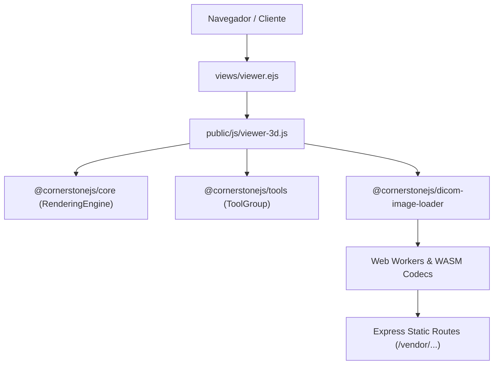

# Plan de Migración y Actualización a Cornerstone3D

Este documento detalla la hoja de ruta y la estrategia técnica para actualizar la pila tecnológica del visor DICOM desde **Cornerstone Legacy** (`cornerstone-core` v2.6, `cornerstone-tools` v6.0, `cornerstone-wado-image-loader` v4.13, `hammerjs`) hacia la suite moderna **Cornerstone3D** (`@cornerstonejs/core`, `@cornerstonejs/tools`, `@cornerstonejs/dicom-image-loader`).

---

## 1. Motivación y Beneficios de Cornerstone3D

| Característica | Cornerstone Legacy (Actual) | Cornerstone3D (Objetivo) |
| :--- | :--- | :--- |
| **Motor de Renderizado** | Canvas 2D / WebGL 1 básico | **WebGL 2 / WebGPU** con aceleración por hardware completa |
| **Rendimiento y Memoria** | Gestión manual de caché en JS | **Memory Management Pool** optimizado para estudios grandes y TAC/Resonancias |
| **Capacidades 3D / MPR** | Solo visualización 2D Stack | Soporte nativo para **Stack (2D)** y **Volume (3D/MPR - Axial, Sagital, Coronal)** |
| **Gestión de Herramientas** | Eventos acoplados a elementos DOM | **ToolGroups** reutilizables desacoplados de los viewports |
| **Decodificadores DICOM** | Web Workers con codecs antiguos | **WebAssembly (WASM)** y Web Workers de alto rendimiento con SIMD |
| **Mantenimiento y Soporte** | Deprecado por la comunidad | En desarrollo activo y con soporte para nuevos estándares médicos |

---

## 2. Decisiones de Arquitectura y Cambios Clave



### 2.1 Cambio en el Ciclo de Vida del Visor
1. **Inicialización Asíncrona:**
   ```javascript
   await cornerstone3D.init();
   await cornerstone3DTools.init();
   cornerstoneDICOMImageLoader.init({ maxWebWorkers: navigator.hardwareConcurrency || 4 });
   ```
2. **Motor de Renderizado (`RenderingEngine`):**
   - En lugar de `cornerstone.enable(element)`, se crea un `RenderingEngine` con identificador único.
   - Se vincula el contenedor `#dicomImage` a un `ViewportType.STACK` (o `ViewportType.ORTHOGRAPHIC` para volúmenes futuros).
3. **Grupo de Herramientas (`ToolGroup`):**
   - Se crea un `ToolGroup` centralizado con:
     - `WindowLevelTool` (Reemplaza a `WwwcTool`)
     - `ZoomTool`
     - `PanTool`
     - `LengthTool`
     - `StackScrollMouseWheelTool` (o `StackScrollTool`)
   - Se agregan las herramientas al grupo y se asocian al viewport.

---

## 3. Fases de Implementación Propuestas

### Fase 1: Actualización de Dependencias y Servidor de Archivos Estáticos
- **Desinstalar dependencias legacy:**
  - `cornerstone-core`, `cornerstone-math`, `cornerstone-tools`, `cornerstone-wado-image-loader`, `hammerjs`.
- **Instalar paquetes Cornerstone3D:**
  - `@cornerstonejs/core`, `@cornerstonejs/tools`, `@cornerstonejs/dicom-image-loader`, `@cornerstonejs/streaming-image-volume-loader`.
- **Configuración de rutas estáticas en `server.js`:**
  - Exponer los decodificadores WASM y Web Workers de `@cornerstonejs/dicom-image-loader/dist/` para que el navegador los consuma sin restricciones de CORS ni errores MIME.

### Fase 2: Modularización del Script del Visor
- Crear un script modular en `public/js/viewer.js` (o `public/js/viewer-cornerstone3d.js`) para separar la lógica de inicialización del archivo [viewer.ejs](file:///c:/Users/Inform%C3%A1tica/OneDrive%20-%20I%20MUNICIPALIDAD%20DE%20TEMUCO/Documentos/proyectos/visor-dicom/views/viewer.ejs).
- Configurar la carga de esquemas `wadouri:` / `wadors:` compatibles con los endpoints actuales del backend (`/dicom/series/.../archivos`).

### Fase 3: Migración de Viewports y Herramientas Interactivas
- Implementar el `RenderingEngine` y vincular el `StackViewport` al div `#dicomImage`.
- Configurar `ToolGroupManager` con las herramientas activas:
  - **Botón WW/WC:** `WindowLevelTool` (Mouse Button 1)
  - **Botón Zoom:** `ZoomTool` (Mouse Button 1 o Mouse Button 2)
  - **Botón Pan:** `PanTool` (Mouse Button 1 o Mouse Button 4)
  - **Botón Regla (Length):** `LengthTool` (Mouse Button 1)
  - **Rueda del mouse:** `StackScrollMouseWheelTool`
- Conectar la barra de botones existente para alternar la herramienta activa con el clic primario.

### Fase 4: Integración con Series, Thumbnails y Descarga JPG
- Adaptar la carga dinámica de series y miniaturas para usar `cornerstone3D.imageLoader` o renderizado ligero para las tarjetas laterales.
- Actualizar la función de descarga de JPG (`btnDownloadJpg`) extrayendo el canvas WebGL renderizado mediante `viewport.getCanvas()`.
- Mantener la compatibilidad total con el modo Legacy (estudios sin series explícitas).

---

## 4. Archivos Afectados

### [MODIFY] [package.json](file:///c:/Users/Inform%C3%A1tica/OneDrive%20-%20I%20MUNICIPALIDAD%20DE%20TEMUCO/Documentos/proyectos/visor-dicom/package.json)
- Reemplazo de paquetes `cornerstone-*` legacy por los paquetes `@cornerstonejs/*`.
- Limpieza de overrides innecesarios de librerías viejas.

### [MODIFY] [server.js](file:///c:/Users/Inform%C3%A1tica/OneDrive%20-%20I%20MUNICIPALIDAD%20DE%20TEMUCO/Documentos/proyectos/visor-dicom/server.js)
- Ajuste de cabeceras HTTP (`Cross-Origin-Opener-Policy`, `Cross-Origin-Embedder-Policy` si se requiere SharedArrayBuffer para volúmenes 3D) y rutas estáticas de WASM/Workers.

### [MODIFY] [views/viewer.ejs](file:///c:/Users/Inform%C3%A1tica/OneDrive%20-%20I%20MUNICIPALIDAD%20DE%20TEMUCO/Documentos/proyectos/visor-dicom/views/viewer.ejs)
- Reemplazo de los `<script src="...">` de vendor legacy por los bundles de Cornerstone3D o script ESM.

### [NEW] `public/js/viewer-engine.js` (Opcional/Recomendado)
- Código limpio, desacoplado y estructurado del ciclo de vida de Cornerstone3D.

---

## 5. Plan de Verificación

### Pruebas Automatizadas
- `npm test`: Verificar que la conversión de imágenes de backend y el parseo sigan intactos.

### Pruebas Manuales y de Compatibilidad
1. **Carga de Estudios Monocromáticos (Rayos X / TAC):** Carga correcta de imágenes de 16 bits sin compresión y con compresión JPEG Lossless.
2. **Interacción con Herramientas:**
   - Probar brillo/contraste (WW/WC) arrastrando el mouse.
   - Probar Zoom y desplazamiento (Pan).
   - Probar trazado de líneas y cálculo milimétrico con la regla (`LengthTool`).
   - Probar navegación entre cortes de la serie con la rueda del ratón (`StackScroll`).
3. **Miniaturas y Cambio de Series:** Cambiar entre series distintas del estudio verificando que el viewport se limpie y cargue la nueva serie fluidamente.
4. **Descarga de JPG:** Exportar la imagen visualizada y verificar que la captura contenga el windowing y las anotaciones aplicadas.
